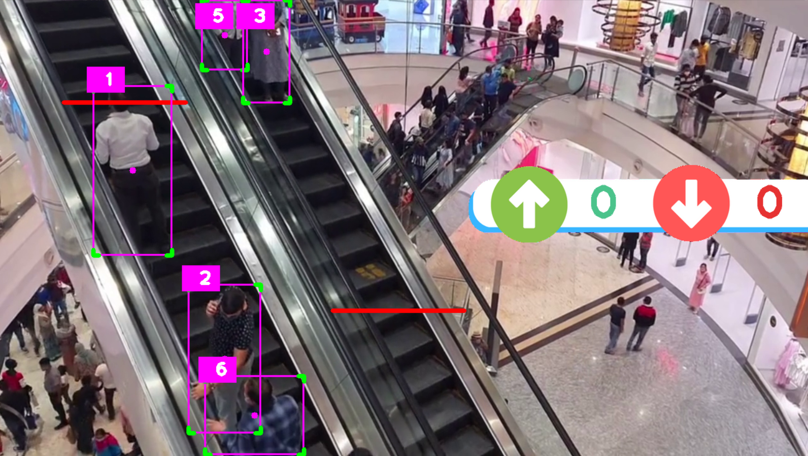
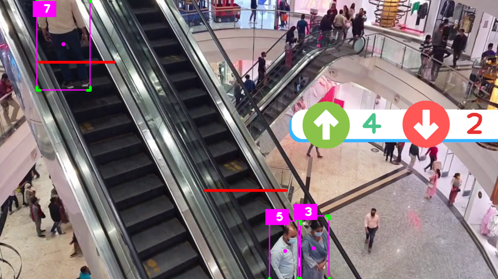

# YOLO-based People Counter Project

## Overview

This project utilizes the YOLO (You Only Look Once) object detection model to count the number of people moving in two directions within a video stream. It employs computer vision techniques to identify and track people while providing a count in real-time for those moving both upwards and downwards.

## Key Features

- **Object Detection:** The project uses the YOLO object detection model to identify persons within the video stream.

- **Real-time Counting:** It counts the number of people moving up and down within specified regions of interest (ROIs) in real-time.

- **Object Tracking:** The Sort (Simple Online and Realtime Tracking) algorithm is implemented to track identified persons across video frames, associating each person with a unique ID.

- **Confidence Filtering:** Detected persons are filtered based on their confidence scores, ensuring that only persons with high confidence levels are counted.

- **Visualization:** The project provides visual feedback by drawing bounding boxes around detected persons and displaying separate counts for those moving up and down in real-time on the video stream.

## How it Works

### Initialization

1. The YOLO object detection model is loaded with pre-trained weights.

2. Two regions of interest (ROIs) are defined within the video frame: one for people moving upwards and one for people moving downwards.

3. The Sort tracker is initialized with parameters such as the maximum age, minimum hits, and IOU (Intersection over Union) threshold.

### Object Detection

1. Video frames are continuously captured.

2. A mask is applied to isolate the ROIs within each frame.

3. The YOLO model is applied to each ROI to detect persons, and their coordinates and confidence scores are extracted.

4. Detected persons with confidence scores above a threshold are considered.

### Object Tracking

1. The Sort tracker is used to track the detected persons across frames, associating each person with a unique ID.

2. The tracker updates the object positions and IDs in each frame.

### Counting and Visualization

1. Bounding boxes are drawn around the detected and tracked persons, providing visual feedback.

2. Separate counts are maintained for persons moving up and down in the specified ROIs.

3. When a tracked person crosses a defined counting line in either ROI, the respective count is incremented.

### Output

1. The video stream with visualizations is displayed in real-time.

2. Separate counts for persons moving up and down are continuously updated and displayed on the video.

## Output Picture

